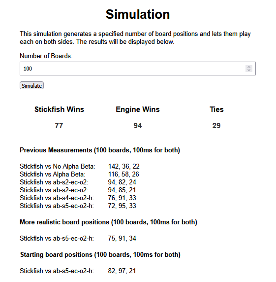

# Kalah Documentation

## Structure
This project consists of **two parts**:
- The **Angular Frontend** for the website
- **C++ code compiled to WebAssembly**, which is called by the Angular code and runs in a web worker

# Angular Code

### **Design**
- I primarily used [Angular Material Components](https://material.angular.io/)
- The website follows a **minimalist design**, with a single centered card on most pages
- A challenge was making the board look good for all possible **pits** values (2-14)

### **Architecture Decisions**
- I used [Angular 18](https://v18.angular.dev/overview) with Signals and experimented with the [Signal Store](https://ngrx.io/guide/signals/signal-store) by NgRx to track game parameters (seed count, pits, player types)
- I created **general components** where possible, such as the **number input fields** (with the increment/decrement buttons) and the **centered cards** used for the rules/credits/about pages
- **GitHub Actions** were used mainly as a learning experience, automating **tests and linting** in the pipeline
- For development, I followed a **single-branch workflow (`main`)**, with a separate branch for **GitHub Pages deployment**

### **Testing**
- Since this is a **solo project**, I did not see a strong need for extensive **unit or end-to-end tests**
- The main focus was testing whether the engine runs **correctly** and makes **optimal decisions**
- I created multiple **test cases** with board positions where only **one move** leads to a win (based on a previous Java implementation I trust)
- These tests are located in `wasm.service.spec.ts` and the test data is in `min-max.ts`

### **Lessons Learned & Future Improvements**
- **Using an HTML `<canvas>`** for the board would have been easier than managing **standard HTML elements**
- **Managing board state** with resetting, doing Com moves etc. got pretty complicated and **Redux-based state management** (like the [Ngrx Store](https://ngrx.io/guide/store)) could have simplified this 

### **Building the Project**
The most important commands (found in `package.json`):
- The commands can be found in the `package.json` but the most important are
- `npm start` which allows you to run it locally
- `npm test` which allows you to run the tests
- `npm run lint` for linting (to fix problems do `npm run lint -- --fix`)
- `npm run deploy` builds the project and deploys it to github pages (I don't want to do this in the pipeline)

# C++ Code

### **How It Works**
- The C++ code receives a **JSON string** containing the board position, player type, and time limit.
- **Com difficulty levels**:
  - **Easy Com**: Returns a random move
  - **Medium Com**: Picks the move that maximizes **immediate points** (but does not plan ahead)
  - **Hard Com and Stickfish**: Use **minimax with [alpha-beta pruning](https://en.wikipedia.org/wiki/Alpha%E2%80%93beta_pruning)** and [iterative deepening](https://en.wikipedia.org/wiki/Iterative_deepening_depth-first_search) until the time limit is reached
  - **Hard Com**: Optimizes for the **best store difference** `(our_store - their_store)`.
  - **Stickfish AI**: Uses a more advanced **evaluation function** (not just store difference) and smarter **move ordering** to significantly improve the search speed

### **Development Approach**
- I tested **different implementations** for speed and efficiency (e.g., **fixed-size arrays** in the board struct were faster than using `std::vector`).
- I  let different versions of the Coms play against each other (`battle-simulator.cpp`) to compare their strength
- To benchmark my best C++ Com (**Engine**) vs. my older Java Program (**Stickfish**), I built a simple vanilla JS frontend in the `simulation` folder, which calls both the WASM Com and a simple Java api I made for the old Stickfish. When a game is over the amount of wins etc. is **instantly** updated  _(See the picture below)_  


### **Building the C++ Code**
You only need to build this if you modify the C++ code, because the compiled **WASM file** is already in the `public` folder.

First you have to clone the [emscripten repo](https://github.com/emscripten-core/emsdk) (into the root directory of this project)

```
git clone https://github.com/emscripten-core/emsdk.git
```

Now you have to paste this into your (linux) shell:
```
cd emsdk

git pull

# Download and install the latest SDK tools.
./emsdk install latest

# Make the latest SDK active for the current user. (writes .emscripten file)
./emsdk activate latest

# Activate PATH and other environment variables in the current terminal
source ./emsdk_env.sh

cd ..
```

Once Emscripten is set up, you can build the **WebAssembly Code** using the command in the `package.json`
```
npm run wasm:build
```