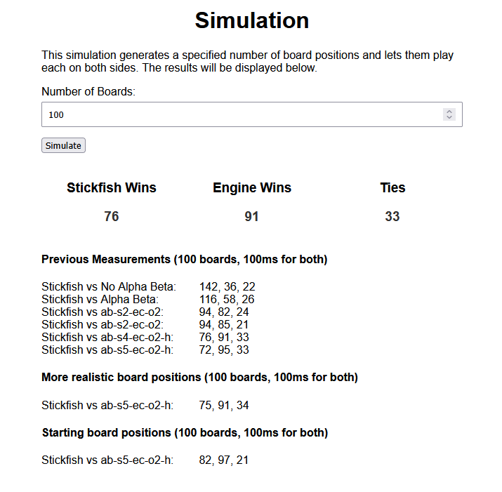

# Kalah Documentation

## Structure
This project consists of 2 parts:
- The regular Angular Frontend Code for the website
- CPP code for the computer programs compiled to webassembly that is called by the Angular Code and run in a web worker

# Angular Code

**Design**:
- I mostly used the Angular Material Components
- I opted for a minimal website design with a single Card in the middle for most sides
- It was a challenge to make the board look okay for all possible pits values (2-14)

**Architecture Decisions**:
- I used Angular 18 with Signals and tried out the Signal Store made by ngrx to keep track of the game params (amount of seeds, pits, different player types)
- I made use of general components where possible, for example for the number input fields (with arrows to increase/decrease) and the centered card used for the rules/credits/about page
- I used github actions mainly to learn about them for automatically running tests and linting in the pipeline
- For development I sticked to a single branch (main), but there is another one where the project is deployed to github pages

**Testing**
- Since I am the only developer working on this project I did not really see a reason for extensive unit testing or end to end tests 
- The main thing I wanted to test is that the engine is called properly and that it is fast and makes good decisions. For this reason I created a lot of test cases with board positions in which only one move can lead to the win (these were made using the old java code which I know worked properly) and run them in wasm.service.spec.ts

**What I learned and would do differently next time**:
- Using the HTML canvas for the board would most likely be a lot easier than moving around the regular html elements
- Managing the board state with resetting, doing computer moves etc is pretty complicated and could have been easier using proper state management like the ngrx store using redux

**Building the project**
- The commands can be found in the package.json but the most important are
- `npm start` which allows you to run it locally
- `npm test` which allows you to run the tests
- `npm run lint` for linting (to fix problems do `npm run lint -- --fix`)
- `npm run deploy` builds the project and deploys it to github pages (I don't want to do this in the pipeline)

# CPP Code
**How it works**
- The cpp code receives a json string from the javascript code which contains the board position the playertype and a timelimit
- Easy COM: just returns a random move
- Medium COM: returns the move that results in the most points in the players own store in the next step (only looks 1 step ahead, move often result in a bad position)
- Hard COM/ Stickfish: do minmax with alpha beta pruning and iterative deepening until the timelimit is reached
- Hard COM: looks for the move that leads to the best store difference (ourstore - theirstore is maximized)
- Stickfish: looks for the move that maximizes the a bit more advanced evaluation function (more than just the store difference) and uses smart move ordering (put more promising moves into the front) which significantly speeds up the search 

**How I approached it**
- I often tried out different approaches and compared their speed. For example I noticed that using an array of fixed size in the board struct is way faster than using the standard vector.
- I let different versions of the program play against each other using the battle-simulator.cpp so I can compare their strength
- To compare my best cpp program with my previously developed Java Program Stickfish I created a simple native js frontend in the simulation folder, that calls the wasm code and the java api (using spring boot) and lets them play against each other. When a game is finished it instantly updates the amount of wins/.. (see the picture) 
 
**How to build it**

Only necessary if you want to make changes to the cpp code, because the compiled wasm file is already in the public folder.

First you have to clone the emscripten repo (into the root directory of this project)
```
git clone https://github.com/emscripten-core/emsdk.git
```

Now you have to paste this into your (linux) shell:
```
cd emsdk

git pull

# Download and install the latest SDK tools.
./emsdk install latest

# Make the "latest" SDK "active" for the current user. (writes .emscripten file)
./emsdk activate latest

# Activate PATH and other environment variables in the current terminal
source ./emsdk_env.sh

cd ..
```

Now you will be able to use emcc to build the webassembly stuff. The command to do that is in the package.json so you can simply do
```
npm run wasm:build
```