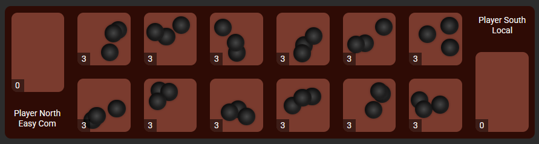

# Kalah Game

Kalah is a traditional two-player strategy board game, also known as "Mancala." This project is a digital version of the game, created for fun, with both a computer opponent and a human player mode. Check it out [here](https://sungonogi.github.io/kalah/).

## Project Overview

- **Website**: Angular Frontend, which calls WebAssembly code to calculate optimal moves.
- **Inspiration**: This project was inspired by a Kalah Tournament at my university (FAU), where we were tasked with programming an AI to compete in the game.

## Features

- Interactive user interface built with Angular
- Computer opponent that calculates optimal moves using the Alpha-Beta Pruning algorithm
- Play against a computer or another player locally

## Rules of Kalah

The objective of Kalah is to capture as many seeds as possible. Players take turns picking seeds from one of their pits, distributing them counterclockwise, and aiming to capture the opponent’s seeds. If you're new to Kalah, don’t worry and jump right in and start playing to get the hang of it!

For more details on the rules, you can refer to the [How to Play](https://sungonogi.github.io/kalah/tutorial) section on the website or read more on [Wikipedia](https://en.wikipedia.org/wiki/Kalah).

## Documentation

For a detailed documentation on my design choices and the architecture of this repository you can check out the [DOCUMENTATION](DOCUMENTATION.md).

## Credits

This website is a personal project, and while it does not require any licensing, I want to acknowledge some of the tools and resources that helped me make it possible. See on the [website](https://sungonogi.github.io/kalah/credits).

## License

The source code for this project is released under the MIT License. See the [LICENSE](LICENSE) file for more details.
